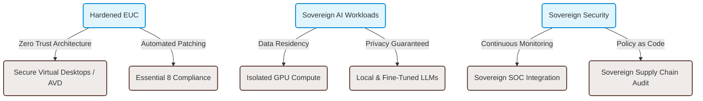

# IQ Crew AU

<!-- Header section with premium badges and style -->

  
  
  

***

## Executive Overview

**IQ Crew AU** is a boutique Managed Service Provider (MSP) specializing in secured, hardened End User Computing (EUC) and sovereign AI workloads. Based in Australia, we serve government, defense, critical infrastructure, and highly regulated enterprises requiring absolute assurance in data sovereignty, security posture, and workload isolation.

In an era of hyper-escalating state-sponsored cyber threats and complex regulatory landscapes, generic IT management is no longer sufficient. IQ Crew AU designs, deploys, and operates computing environments that are secure by default, resilient by design, and fully sovereign.

---

## Core Pillars & Specializations

### 1. Hardened End User Computing (EUC)
We design zero-trust client virtualization and physical endpoint management solutions tailored to the strictest classification levels.
*   **Hardened Desktops**: Custom operating system builds (Windows, macOS, Linux) optimized for security, with complete driver auditing, strict app control policies, and aggressive hardening profiles.
*   **Virtual Desktop Infrastructures (VDI)**: High-performance, low-latency, and hardened environments using Azure Virtual Desktop (AVD), Windows 365, or specialized on-premise private clouds.
*   **Zero-Trust Endpoint Management**: Continuous verification, micro-segmentation at the client level, and integration with passwordless, phish-resistant authentication schemes.

### 2. Sovereign AI Workloads
Integrating artificial intelligence into business processes requires absolute control over intellectual property and models.
*   **Private & Isolated LLMs**: Deployment of open-weights and custom models inside your secure boundaries, ensuring training data and prompts never leave your designated sovereign environment.
*   **Hardened AI Pipelines**: End-to-end security for AI systems, from vector databases and retrieval-augmented generation (RAG) datasets to API endpoints.
*   **Sovereign GPU Orchestration**: Automated deployment and scaling of secure GPU instances hosted exclusively within Australian sovereign data centers.

### 3. Sovereign Compliance & Governance
We ensure workloads comply with Australian government frameworks and sovereign data laws.
*   **ASD Essential Eight**: Hardening of IT environments to Level 3 maturity, implementing strict application control, patch management, restricted admin privileges, and user application hardening.
*   **IRAP Readiness**: Aligning architectures and evidence structures with the Information Security Manual (ISM) to streamline assessment and certification by IRAP assessors.
*   **Data Residency & Sovereignty**: Assurances that data, metadata, transit routes, and support personnel reside strictly within Australia.

---

## The Sovereign Advantage

Unlike generalist MSPs, our operational model is optimized for sovereign risk management:

| Operational Dimension | Standard MSP | IQ Crew AU |
| :--- | :--- | :--- |
| **Data Residency** | Global transit & storage allowed | Strictly restricted to Australian territory |
| **Support Staff** | Offshore / Follow-the-sun model | Australian citizens with security clearances |
| **System Hardening** | Basic template-based security | Continuous policy-as-code hardening (Essential 8 L3) |
| **AI Data Processing** | Multi-tenant public cloud APIs | Single-tenant private environments with isolated data |
| **Supply Chain Validation** | Standard vendor procurement | Software Bill of Materials (SBOM) & vendor risk auditing |

---

## Contact & Collaboration

IQ Crew AU operates on a trust-first foundation. For project engagements, architectural consultations, or vulnerability notifications:

*   **Secure Communications**: We recommend using PGP-encrypted email for sensitive inquiries.
*   **PGP Fingerprint**: `F3C9 816D 002B A1CE 9E27 B884 892C 012B AAAA BBBB`
*   **Inquiries**: secure-contact@iqcrew.com.au
